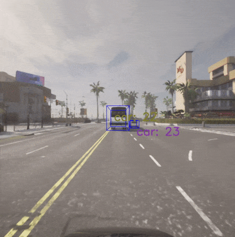

# Object Tracking in CARLA


## 2D Object Detection


2D Object Detection (YOLO)

```
python 2d-detection-yolo.py
```


2D Object Detection (SSD)

```
python 2d-detection-ssd.py
```


2D Object Detection (FRCNN)

```
python 2d-detection-frcnn.py
```


## 2D Object Tracking


Ground Truth + SORT

```
python 2d-tracking-gt-sort.py
```


Ground Truth + Deep SORT

```
python 2d-tracking-gt-deep-sort.py
```


Ground Truth + Strong SORT

```
python 2d-tracking-gt-strong-sort.py
```


Ground Truth + OC SORT

```
python 2d-tracking-gt-oc-sort.py
```


YOLO + SORT

```
python 2d-tracking-yolo-sort.py
```


YOLO + Deep SORT

```
python 2d-tracking-yolo-deep-sort.py
```


YOLO + Strong SORT

```
python 2d-tracking-yolo-strong-sort.py
```


YOLO + OC SORT

```
python 2d-tracking-yolo-oc-sort.py
```


## 3D Object Tracking




Ground Truth (Detection)

```
python 3d-detection-gt.py
```


Ground Truth + SORT

```
python 3d-tracking-gt-sort.py
```

